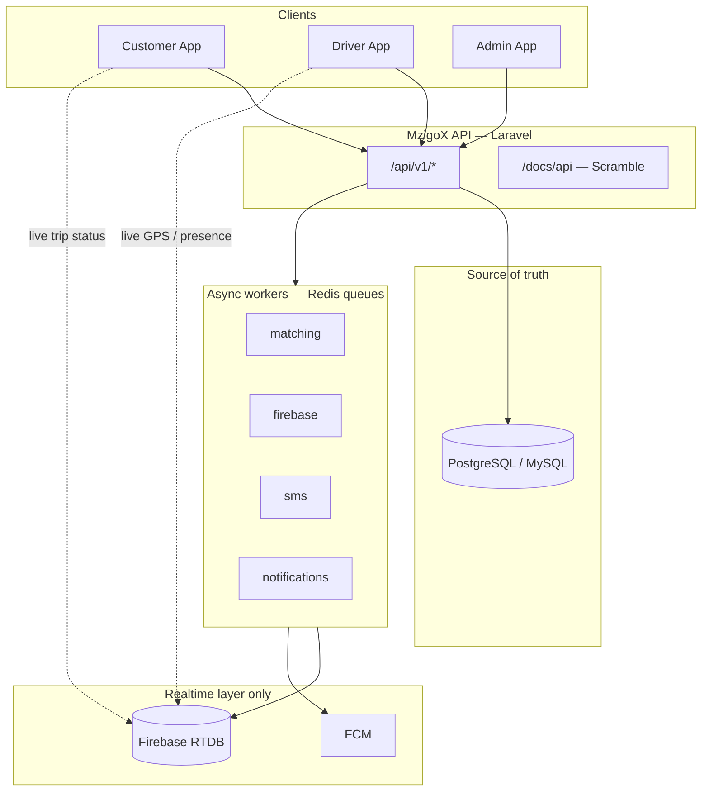
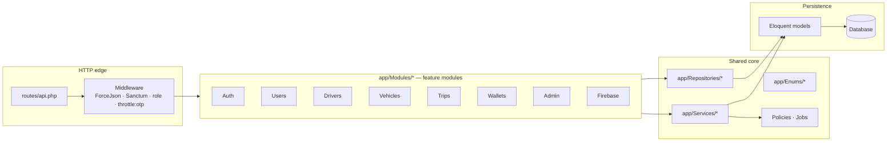
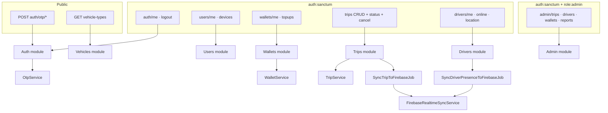
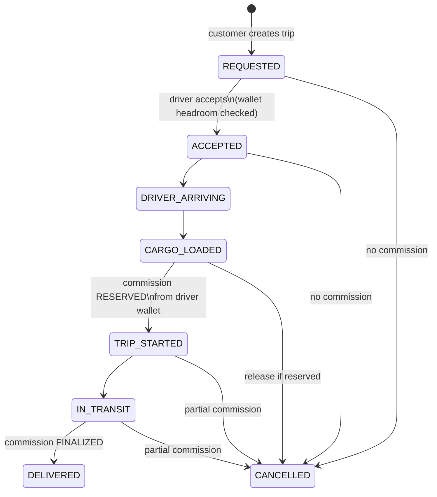
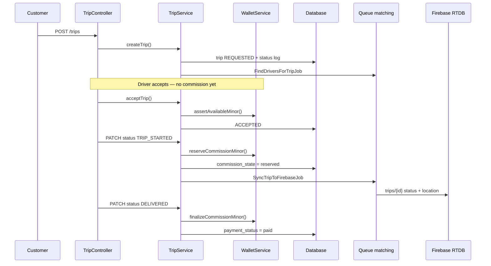
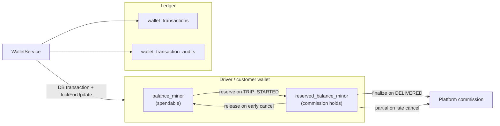
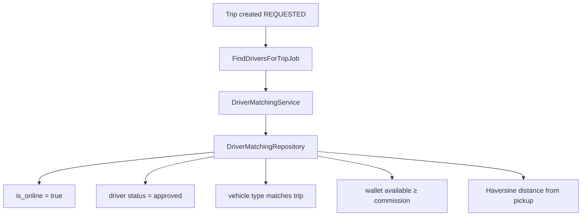
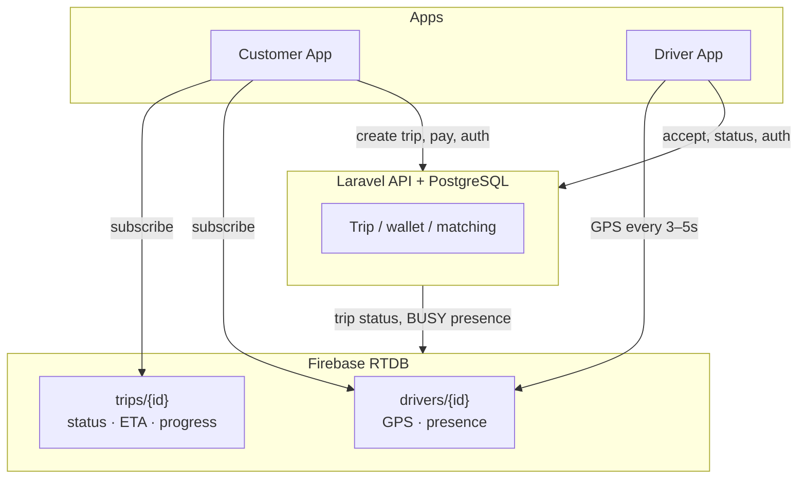
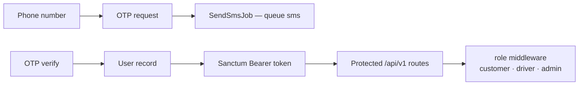

# MzigoX API — System Architecture

MzigoX is a **multi-vehicle cargo mobility platform** (not parcel delivery). Customers request vehicles to move cargo; drivers operate with **prepaid wallet commission**, **trip lifecycle management**, and **realtime tracking** via Firebase.

**Stack:** Laravel · PostgreSQL/MySQL · Sanctum · Redis queues · Firebase RTDB (realtime only) · FCM · Scramble API docs.

---

## 1. System context



### Source-of-truth rule

| Store | Holds |
|-------|--------|
| **Laravel + DB** | Users, drivers, vehicles, trips, wallets, ledger, commissions, audits, notifications |
| **Firebase RTDB** | Live GPS, online presence, trip status sync, ETA only |
| **Never in Firebase** | Wallet balances, prices, financial records, permanent business data |

---

## 2. Application layers



| Layer | Responsibility |
|-------|----------------|
| **Controllers** | Thin; validate via Form Requests, return `ApiResponse` + API Resources |
| **Services** | Business logic: trips, wallets, OTP, matching, commission |
| **Repositories** | Query and matching data access |
| **Jobs** | Side effects: Firebase sync, matching, SMS, FCM, analytics |

---

## 3. Module map (routes)

Base path: **`/api/v1`**. Defined in `routes/api.php`.



### Roles

- `customer` — create trips, cancel, wallet
- `driver` — accept trips, update status/location, wallet
- `admin` — approvals, monitoring, reports

### Endpoint summary

| Area | Routes |
|------|--------|
| **Auth** | `POST auth/otp/request`, `POST auth/otp/verify`, `GET auth/me`, `POST auth/logout` |
| **Users** | `PATCH users/me`, `POST users/me/devices` |
| **Wallets** | `GET wallets/me`, `POST wallets/me/topups` |
| **Trips** | `POST/GET trips`, `GET trips/{id}`, `POST accept`, `PATCH status`, `POST cancel` |
| **Drivers** | `GET drivers/me`, `PATCH online`, `POST location` |
| **Vehicles** | `GET vehicle-types` |
| **Admin** | `GET admin/trips/active`, `POST admin/drivers/{id}/approve`, `GET admin/wallets`, `GET admin/reports/commission`, `GET admin/disputes` |

---

## 4. Trip lifecycle



### Trip flow sequence



**Validation:** `TripStateValidator` enforces allowed transitions. Every change is logged in `trip_status_logs`.

---

## 5. Prepaid commission & wallet

Drivers preload operational balance. Commission is **not** taken on accept — only reserved when the trip **starts**.



| Transaction type | Purpose |
|------------------|---------|
| `topup` | Add spendable balance |
| `withdrawal` | Cash out |
| `trip_payment` | Customer trip payment |
| `commission` | Driver platform fee (reserve → finalize) |
| `refund` | Reversal |
| `bonus` | Promotional credit |

**Services:** `WalletService` (atomic ops), `WalletBalanceService` (available vs reserved), `CommissionCalculator` (rate + cancel rules).

---

## 6. Driver matching engine

Triggered by `FindDriversForTripJob` on queue `matching`.



---

## 7. Firebase — live radar layer

**Full specification:** [FIREBASE.md](./FIREBASE.md)

```text
Laravel + PostgreSQL  =  Brain + Bank (permanent truth)
Firebase RTDB         =  Live Radar (transient operations)
```



| Data | Primary writer | Store of record |
|------|----------------|-----------------|
| Live GPS | **Driver app → Firebase** | Firebase (transient) |
| Trip status / commission | **Laravel API** | PostgreSQL |
| Presence ONLINE/OFFLINE/BUSY | Driver app + Laravel | PostgreSQL + Firebase sync |
| Location snapshot for matching | Laravel `drivers/me/location` | PostgreSQL |

**Never in Firebase:** wallet balances, commissions, payments, pricing, permanent history.

**Jobs:** `SyncTripToFirebaseJob`, `SyncDriverPresenceToFirebaseJob` (queue: `firebase`).

**Security rules template:** `firebase/database.rules.json`

---

## 8. Authentication & security



- **OTP:** `OtpService` + `phone_otps` table (hashed codes, TTL, attempt limits)
- **Tokens:** Laravel Sanctum (`personal_access_tokens`, UUID morph map includes `user`)
- **Rate limiting:** `throttle:otp` on OTP endpoints
- **Policies:** `TripPolicy` (view, accept, cancel, updateStatus)
- **Mass assignment:** guarded models + Form Request validation

---

## 9. Queues & notifications

| Queue | Job | Purpose |
|-------|-----|---------|
| `matching` | `FindDriversForTripJob` | Candidate driver search |
| `firebase` | `SyncTripToFirebaseJob`, `SyncDriverPresenceToFirebaseJob` | RTDB sync |
| `sms` | `SendSmsJob` | OTP / fallback SMS |
| default | `SendFcmNotificationJob` | Push notifications (FCM stub) |
| default | `AnalyticsEventJob` | Analytics hook |

Production: set `QUEUE_CONNECTION=redis` and run workers per queue.

---

## 10. API response contract

All responses use:

```json
{
  "success": true,
  "message": "Operation successful",
  "data": {}
}
```

Failures return `success: false` with appropriate HTTP status (401, 403, 422, etc.). Implemented in `App\Helpers\ApiResponse`.

---

## 11. Project structure

```
app/
├── Modules/
│   ├── Auth/          OTP + Sanctum login
│   ├── Users/         profile, devices (FCM tokens)
│   ├── Drivers/       KYC state, online, GPS
│   ├── Vehicles/      types + vehicles
│   ├── Trips/         lifecycle + status logs
│   ├── Wallets/       balance + ledger
│   ├── Firebase/      realtime sync service
│   └── Admin/         ops + reports
├── Services/          Trip, Wallet, OTP, Matching, Commission
├── Repositories/      Trip, DriverMatching
├── Jobs/              matching, firebase, sms, fcm, analytics
├── Enums/             statuses & transaction types
├── Policies/          TripPolicy
├── Http/Middleware/   ForceJsonResponse, EnsureUserRole
└── Helpers/           ApiResponse

routes/api.php         → all /api/v1 endpoints
bootstrap/app.php      → API routes, exception handling, middleware
config/scramble.php    → OpenAPI at /docs/api
database/migrations/   → UUID schema, FKs, indexes
tests/Feature/         → OTP, wallet/trip, Sanctum flows
```

---

## 12. Documentation & local run

| Resource | URL / command |
|----------|----------------|
| API docs | `/docs/api` (Scramble) |
| OpenAPI JSON | `/docs/api.json` |
| Health | `/up` |
| Migrate + seed | `php artisan migrate --seed` |
| Tests | `php artisan test` (uses `mzigox_testing` DB per `phpunit.xml`) |
| Serve | `php artisan serve` |

---

## 13. Design principles (from PROJECT.MD)

1. **Thin controllers** — logic lives in services.
2. **DB transactions** for all wallet mutations (`lockForUpdate`).
3. **Enums** for trip, driver, wallet, and payment states.
4. **UUID primary keys** across domain tables.
5. **Firebase is a sync layer**, not a datastore for business or financial data.
6. **Modular features** under `app/Modules/` for scalable team ownership.
